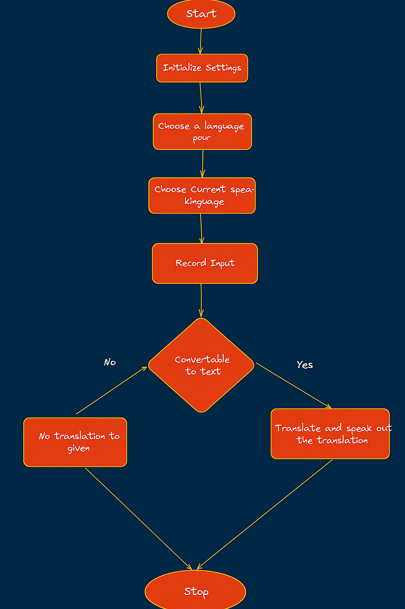

# Speech2SpeechTranslation
A Speech-to-Speech translation model which uses a neural network for translation and provide a communicational translation to allow multilinguistic conversations.

# WorkFlow

- A language pair is selected first
- The user selects the language from the pair selected
- This selection triggers the start recording request to the backed
- The backend starts to record the audio from the microphone
- This recorded audio is converted into text form
- The input text is tokenized using the tokenizer and passed to the model
- The model evaluates the input and translate it to the desired language
- Translated text is sent to the TextToSpeech parser and the audio is played

# Translations Samples

### English as source
| English                          | Hindi                            | German                                    | French                                 |
| -------------------------------- | -------------------------------- | ----------------------------------------- | -------------------------------------- |
| 'Hello, how are you'             | 'हैलो, तुम कैसे हो'              | "Hallo, wie geht's dir?"                  | 'Bonjour, comment allez-vous ?'        |
| My health is not good!           | मेरा स्वास्थ्य अच्छा नहीं है!    | Meine Gesundheit ist nicht gut!           | Ma santé n'est pas bonne !             |
| I went to my grandma's house     | मैं अपने दादी के घर चला गया      | Ich war bei meiner Oma.                   | Je suis allé chez ma grand-mère.       |
| Where have you been till now?    | आप अब तक कहाँ किया गया है?       | Wo warst du bis jetzt?                    | Où étais-tu jusqu'à maintenant ?       |
| TechXcelerate hackathon was fun! | टेकक्सारेट हैलीनन मज़ा आ रहा था! | TechXcelerate Hackathon hat Spaß gemacht! | TechXcelerate hackathon était amusant! |

# Packages used
### Backend
- [Flask](https://flask.palletsprojects.com/en/stable/)
- [Flask Cors](https://flask-cors.readthedocs.io/en/latest/)
- [Transformers](https://huggingface.co/docs/transformers/v4.17.0/en/index)
- [PyTorch](https://pytorch.org/)
- [pyttsx3](https://pyttsx3.readthedocs.io/en/latest/index.html)
- [Speech Recognition](https://pypi.org/project/SpeechRecognition/)

### FrontEnd
- [React](https://react.dev/)
- [Node](https://nodejs.org/en)

# Flowchart

